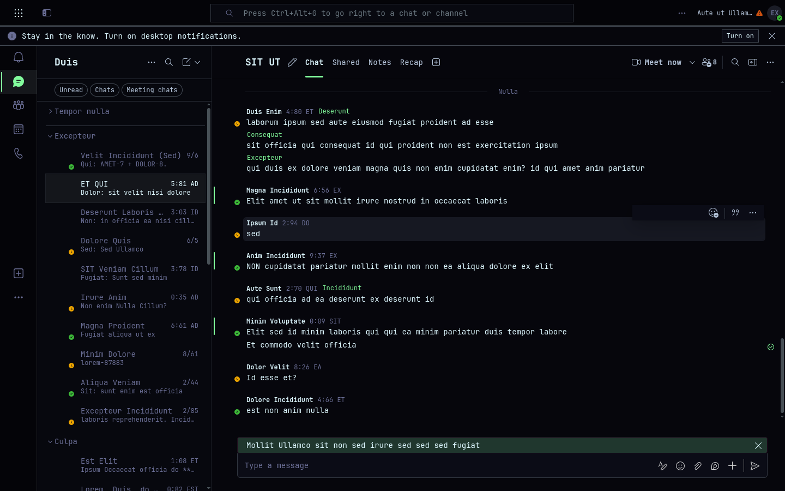

# Omateams

Microsoft Teams for [Omarchy](https://omarchy.org): the real Teams web client in
its own window, re-skinned live with your Omarchy theme, plus an unread badge in
the bar and desktop notifications.

You sign in the normal way. Calls, meetings, screen sharing, files, all of Teams
keeps working, because it *is* Teams — only the paint changes. Every Fluent
design token the client draws with is remapped to your theme's `colors.toml`,
corners follow Hyprland's rounding, and switching the Omarchy theme restyles
the open window without a reload.



## How it works

Teams is built on Fluent UI v9, which paints every surface from CSS custom
properties such as `--colorNeutralBackground1` and `--colorBrandBackground`.
Omateams injects one stylesheet that redefines all of them (208 tokens) from
the handful of colors an Omarchy theme ships, so nothing in Teams has to be
matched by selector.

Two parts:

- **The host** (`omateams`) — a small Qt/QML program that hosts Teams in a
  QtWebEngine view with a persistent profile, injects the theme, watches the
  Omarchy theme directory, forwards Teams' notifications to `notify-send`,
  handles sign-in popups, downloads and screen-share permissions, and writes a
  status file. It runs as its own process on purpose: a Chromium renderer
  fault must never take the desktop shell down with it, and Quickshell cannot
  initialise the WebEngine anyway.
- **The Omarchy plugin** (this repository's `manifest.json` + `ui/`) — a bar
  widget with the unread count, a service that watches the host's status file,
  starts the host hidden with the shell, and hands the plugin settings over.

## Install

```bash
omarchy plugin add https://github.com/Divanyx/omateams.git --enable
~/.config/omarchy/plugins/omateams/install.sh
```

`install.sh` builds the host (a few seconds with `qmake6`, dependencies
`qt6-webengine`, `qt6-declarative`, `libnotify`, `jq`, `base-devel` are
installed with `pacman` if missing) and puts it in
`~/.local/share/omateams/bin/omateams`, with a symlink in `~/.local/bin`, a
desktop entry and an icon. Then:

- click the Teams icon in the bar, or run `omateams`
- sign in as you would in a browser

The window opens tiled like any other; a Hyprland rule can float or pin it
(`class: omateams`). Optional keybinding in `~/.config/hypr/bindings.lua`:

```lua
o.bind("SUPER + SHIFT + T", "Teams", "omateams toggle")
```

Update with `omarchy plugin update omateams` and re-run `install.sh` so the
host matches. Remove with `~/.config/omarchy/plugins/omateams/uninstall.sh`
(`--purge` also deletes the signed-in profile) and `omarchy plugin remove omateams`.

## Bar widget

| Click  | Action                         |
|--------|--------------------------------|
| left   | show / hide the Teams window   |
| right  | show and focus it              |
| middle | re-read the status file        |

The icon is the Teams glyph from the Nerd Font the bar already uses; it dims
while Teams is not running, an accent dot marks unread messages or activity
and the count sits next to it. The launcher icon is a pixel-grid take on the
Teams mark, recolored from the active theme at install time.

Settings live on the widget's entry in `~/.config/omarchy/shell.json`
(Setup › Plugins in the shell, or `omarchy bar set`):

| Key               | Default                         | Meaning |
|-------------------|---------------------------------|---------|
| `showBarIcon`     | `true`                          | Hide the icon and drive Teams from a keybinding instead |
| `showCount`       | `true`                          | Unread count next to the icon |
| `runInBackground` | `true`                          | Start the window hidden with the shell, so the badge and notifications work before you open it |
| `notifications`   | `On`                            | Forward Teams notifications to the Omarchy notification daemon; clicking one opens the conversation |
| `followTheme`     | `true`                          | Re-skin Teams with the Omarchy theme; off keeps Microsoft's look |
| `useShellFont`    | `true`                          | Render Teams in the shell's monospace family |
| `zoom`            | `100`                           | Zoom in percent |
| `closeAction`     | `Hide window`                   | What the window's close button does; `Quit` ends the process |
| `url`             | `https://teams.cloud.microsoft/` | Teams endpoint |

## CLI

```
omateams                 open (or focus) the window, starting Teams if needed
omateams --hidden        make sure Teams runs, without showing the window
omateams toggle          show / hide
omateams show | hide
omateams status          JSON: running, unread, visible, title, pid
omateams reload-theme    re-read colors.toml and Hyprland's rounding
omateams quit
```

In the window: `Ctrl+W` hides, `Ctrl+Q` quits, `Ctrl+R` reloads Teams,
`Ctrl+Shift+T` re-applies the theme.

## Theming details

`host/qml/Theme.js` turns `colors.toml` into Fluent tokens:

- `background` is the main surface; `dark_background` / `darker_background`
  (or computed steps) are the deeper rails and panes, in both light and dark
  themes; a slightly raised surface serves cards and popovers.
- `foreground`, `light_foreground`, `dark_foreground` are primary, secondary
  and tertiary text; disabled text and stroke colors are blends between
  foreground and background.
- `accent` is the brand color: buttons, links, focus rings, selection; the text
  on it is whichever theme color reads best, falling back to black or white.
- `green`, `yellow`, `red` are the success, warning and danger status colors.
  Presence colors are left alone — available, busy and away keep their meaning.
- `decoration:rounding` from Hyprland sets the border radii; a sharp theme
  yields a sharp Teams.
- With `useShellFont`, `--fontFamilyBase` becomes `monospace`, which
  fontconfig resolves to the same family the bar uses.

`node tests/theme.test.js` checks the mapping against every theme installed
under `/usr/share/omarchy/themes`.

## Notes and limitations

- **Sign-in and cookies.** The session lives in a normal Chromium profile under
  `~/.local/share/omateams/QtWebEngine/`, like any browser or Omarchy web app.
  Sign-in popups open in an in-app dialog so the session lands in that profile;
  other links open in your default browser.
- **Memory.** Teams is a heavy web app; expect the footprint of a browser tab
  with Teams in it. `runInBackground: false` starts it only on demand.
- **Screen sharing** goes through PipeWire and the desktop portal
  (`xdg-desktop-portal-hyprland`), which Omarchy ships.
- **What theming can't reach.** Colors baked into images, avatars and a few
  hard-coded brand accents in Teams' own SVGs stay as they are.
- Omateams is not affiliated with Microsoft. Microsoft Teams is a trademark of
  Microsoft Corporation.

## Development

```bash
# host, loading QML from disk instead of the compiled resources
mkdir -p ~/.cache/omateams/build && cd ~/.cache/omateams/build
qmake6 OMATEAMS_VERSION=dev ~/Projects/omateams/host/omateams.pro && make
OMATEAMS_QML_DIR=~/Projects/omateams/host/qml ./omateams --debug-port 9333

# then inspect the live page at http://127.0.0.1:9333/json (Chrome DevTools protocol)
node tests/theme.test.js
omarchy plugin validate .
```

Saving a file under `~/.config/omarchy/plugins/omateams/ui/` hot-reloads the
bar widget and service in the running shell.

## License

MIT — see [LICENSE](LICENSE).
